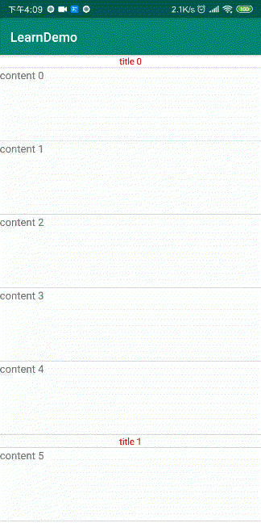
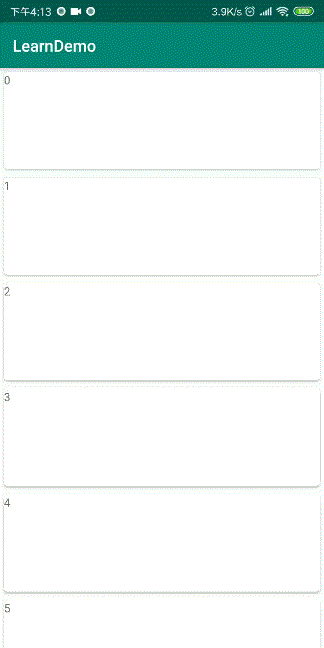

## 这是一个对学习过程中部分内容的一个总结和记录的项目

### RecyclerView 的ScrollListener以及部分API的配合使用来实现部分效果
#### 列表标题吸顶效果
配合`findChildViewUnder`使用，在RecyclerView上盖一层，header放在recyclerView的顶部，然后滚动时根据header底部的View的数据来设置对应的数据以及位置

#### 列表底部缩放效果
监听最后一个View目前展示的状态，根据已经显示出来的比例（`getGlobalVisibleRect`）来计算缩放比

#### 仿知乎列表滑动广告
根据View在屏幕中的位置，设置展示比例

